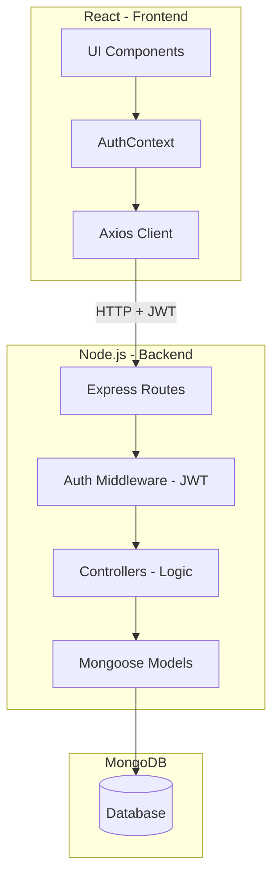

# 🚀 Team Task Manager - Interview Prep Guide

This document provides a structured breakdown of the project architecture, data flow, and technical highlights to help you explain the project during interviews.

---

## 1. Project Overview
**"What is this project?"**
A full-stack collaborative task management system built with the **MERN stack** (MongoDB, Express, React, Node.js). It features:
- **Role-Based Access Control (RBAC)** (Admin vs. Member).
- **Interactive Kanban Board** for task lifecycle management.
- **Dynamic Dashboard** with real-time statistics.
- **Premium UI** using Tailwind CSS and Framer Motion (Glassmorphism).

---

## 2. Technical Architecture

### **The Stack**
- **Frontend**: React (Vite), React Router, Context API, Tailwind CSS, Framer Motion, Axios.
- **Backend**: Node.js, Express, JWT, Bcrypt.js, Helmet, Morgan.
- **Database**: MongoDB with Mongoose ODM.

### **System Flow Diagram**

---

## 3. Core Features & Implementation

### **A. Secure Authentication**
- **Process**: Users register with hashed passwords (via **bcryptjs**).
- **Tokens**: Upon login, the server issues a **JWT** stored in the browser's local storage.
- **Authorization**: A custom middleware verifies the token for every protected API request.

### **B. Frontend State Management**
- **Context API**: Used to manage the global authentication state (`user`, `loading`, `isAuthenticated`).
- **Protected Routes**: A `PrivateRoute` component prevents unauthenticated users from accessing the dashboard.

### **C. UI/UX Design**
- **Modern Aesthetics**: Implemented a "Dark Mode" glassmorphism theme.
- **Micro-animations**: Used **Framer Motion** for smooth transitions between pages and task cards.

---

## 4. Interview "Deep Dive" Questions

### **Q: Why did you choose Vite over Create React App (CRA)?**
**Answer**: Vite uses ES modules and an extremely fast development server (HMR). It significantly improved my productivity compared to the slower build times of Webpack-based tools like CRA.

### **Q: How do you handle relationships between Users and Tasks in MongoDB?**
**Answer**: I used **References**. Each Task document contains a `project` ID and an `assignedTo` user ID. I then use Mongoose's `.populate()` method to join this data when the frontend needs to display user names or project titles.

### **Q: What is the benefit of using Helmet.js in Express?**
**Answer**: Helmet is a security middleware that sets various HTTP headers (like X-Frame-Options and Content-Security-Policy) to protect the app from common attacks like Cross-Site Scripting (XSS) and clickjacking.

---

## 5. Summary of Workflow
1. **Request**: User clicks "Mark Task as Completed".
2. **Frontend**: Axios sends a `PATCH` request to `/api/tasks/:id` with the new status and the JWT in the header.
3. **Backend**: 
   - `authMiddleware` verifies the token.
   - `taskController` updates the MongoDB document.
4. **Response**: Server sends back the updated task.
5. **State Update**: React updates the local state, and the Kanban board card moves visually to the "Completed" column.

---
*Good luck with your interview!*
